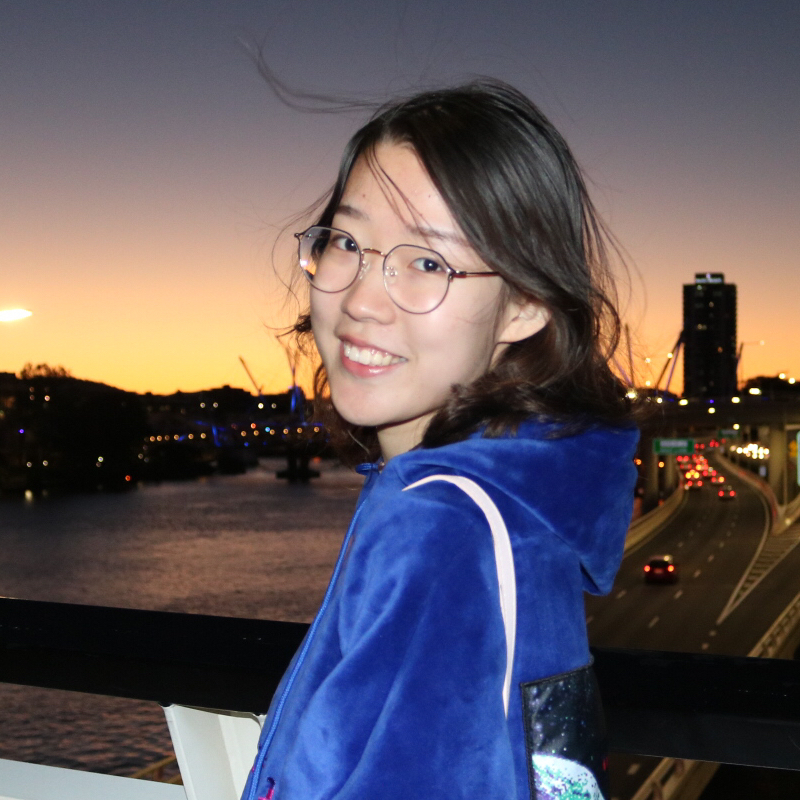

[Department of Computer Science, University of Oxford](https://www.cs.ox.ac.uk/)    
[Machine Learning and Global Health Network](https://mlglobalhealth.github.io/)  
Email: mengyan.zhang@cs.ox.ac.uk         
[[CV](files/MengyanZhang_CV.pdf)|[Google Scholar](https://scholar.google.com/citations?user=Dqot5i0AAAAJ&hl=zh-CN)|[Github](https://github.com/Mengyanz)| [Twitter](https://twitter.com/MengyanZg)|[Linkedin](https://www.linkedin.com/in/mengyan-zhang-a1466a212/)]

I am Mengyan Zhang (张梦妍), a postdoctoral researcher at the University of Oxford, working with Prof. [Seth Flaxman](https://sethrf.com/). I am a research member of common room in [Kellogg College](https://www.kellogg.ox.ac.uk/). 
Before that, I received my PhD at the Australian National University, under the supervision of Dr. [Cheng Soon Ong](http://www.ong-home.my/index.html), Prof. [Lexing Xie](http://users.cecs.anu.edu.au/~xlx/) and Prof. [Eduardo Eyras](https://jcsmr.anu.edu.au/people/academics/professor-eduardo-eyras). 
I was affiliated with Data61, CSIRO and interned at Microsoft Research Asia during my PhD. 
I'm also short-termly mentored by [Sebastien Bubeck](http://sbubeck.com/) via the [WiML-T Mentoring Program](https://www.wiml-t.org/mentoring-program) in 2021. 
Prior to that, I obtained my bachelor's degree with first-class honours at the Australian National University and bachelor's degree at Shandong University in 2018 ([2 + 2 joint degree program](https://cecs.anu.edu.au/study/meet-our-students/mengyan-zhang)). 

My research interests are sequential decision-making in machine learning, including multi-armed bandits and active learning. I work on both theoretical and practical views of experimental design with two goals:
(I) Designing robust algorithms to handle imperfect feedback and understand causal relationships in sequential decision-making. (II) Designing decision-making algorithms to solve real-world problems in various areas, for example, synthetic biology, global health, survey design, and public policy.

## Jobs
- Postdoctoral Researcher (2023.05 -),
Computational Statistics and Machine Learning, Department of Computer Science, University of Oxford
- NCI-ANU Associate Training Officer (2023.04-2023.07, Casual)
- Research Assistant (2023.04-2023.06) in the University of Tuebingen, working with [Claire Vernade](https://www.cvernade.com/).
- Research Assistant (2022.10-2023.04) in RPTU Kaiserslautern and German Research Center for Artificial Intelligence (DFKI), [Vollmer Research Group](https://sebastian.vollmer.ms/)
- Research Internship ( 2021.10 - 2022.03),
Social Computing Lab, Microsoft Research Asia, worked on deep contextual
bandits for news recommendation.
- Academic Tutor (2019-2021)
Australian National University, paid teaching position, total working hours: 300h

## Research & Publications/Preprint

- PhD Thesis: Adaptive Recommendations with Bandit Feedback {[ANU Open Research Library](https://openresearch-repository.anu.edu.au/handle/1885/284132)} (supervisors: [Cheng Soon Ong](http://www.ong-home.my/index.html), [Lexing Xie](http://users.cecs.anu.edu.au/~xlx/), [Eduardo Eyras](https://jcsmr.anu.edu.au/people/academics/professor-eduardo-eyras))

- Two-Stage Neural Contextual Bandits for Personalised News Recommendation.  
 **Mengyan Zhang**, Thanh Nguyen-Tang, Fangzhao Wu, Zhenyu He, Xing Xie, Cheng Soon Ong. Under Review.  {[pre-print](https://arxiv.org/abs/2206.14648)}

- Gaussian Process Bandits with Aggregated Feedback.  
**Mengyan Zhang**, Russell Tsuchida, Cheng Soon Ong. AAAI 2022. {[pre-print](https://arxiv.org/abs/2112.13029); [code](https://github.com/Mengyanz/GPOO); [poster](files/wiml2021_poster.png); [one-page abstract](files/wiml2021_abstract.pdf)}

- Machine learning guided batched design of a bacterial Ribosome Binding Site.   
  **Mengyan Zhang**, Maciej Bartosz Holowko, Huw Hayman Zumpe, Cheng Soon Ong. ACS Synthetic Biology Journal 2022.
  {[paper](https://pubs.acs.org/doi/10.1021/acssynbio.2c00015); [C3DIS 2020 Talk](http://www.c3dis.com/3846); [SEED 2021 Talk]()}

- Quantile Bandits for Best Arms Identification.  
  **Mengyan Zhang**, Cheng Soon Ong. International Conference on Machine Learning 2021. {[paper](https://proceedings.mlr.press/v139/zhang21o); [code](https://github.com/Mengyanz/QSAR); [poster](files/icml2021_quantile_bandits_poster.png); [talk](https://slideslive.com/38958832/quantile-bandits-for-best-arms-identification?ref=account-90553-history)}

- Opportunities and Challenges in Designing Genomic Sequences.  
**Mengyan Zhang**, Cheng Soon Ong. ICML Workshop on Computational Biology 2021. {[paper]((files/wcb_main.pdf)); [poster](files/wcb2021_poster.png); [talk](https://slideslive.com/38959950/opportunities-and-challenges-in-designing-genomic-sequences?ref=speaker-78576-latest)}

- Active Learning on Knowledge Graph.
{[software](https://github.com/chengsoonong/acton); [flowchart](https://github.com/chengsoonong/acton/blob/master/docs/design/acton.pdf); [design](https://github.com/chengsoonong/acton/blob/master/docs/PRESCAL%20Updating%20Design.ipynb)}

- Honours project: Classification of historical death and occupation coding  {[thesis](files/Classification_of_historical_death_and_occupation_coding.pdf)} 
  (supervisors: [Peter Christen](https://users.cecs.anu.edu.au/~Peter.Christen/), [Timothy Graham](https://scholar.google.com.au/citations?user=9GG-wWEAAAAJ&hl=en))
  
## Teaching & Supervision
- Served as College Advisor in Kellogg College (MT23), providing mentorship to 7 postgraduate students. 
- Guest lecturer at [RMIT](https://www.rmit.edu.au/) Bioinformatics and Multi-omics data analysis (BIOL 2524) : introduction to ML and applications in biology (remotely, 3 lectures, May 2023) -- [course materials](https://github.com/Mengyanz/RMIT-NCI-Week/tree/slides)
- Tutor [Statistical Machine Learning](https://programsandcourses.anu.edu.au/2021/course/COMP8600) (S1 2019, S1 2020, S1 2021)
- Tutor [Introduction to Machine Learning](https://programsandcourses.anu.edu.au/2021/course/COMP6670) (S2 2020)
- **(Mar.-Jun. 2021)** co-supervision on Nathan Hu for applying [DNABERT](https://www.biorxiv.org/content/10.1101/2020.09.17.301879v1) to [yeast promotor](https://www.nature.com/articles/s41467-020-15977-4). See details [here](https://github.com/chengsoonong/eheye/tree/master/nathan_project)!

## Talks & Presentations
- **Dec. 2023**: Google DeepMind, London   
Design Choices in Sequential Decision-Making with Bandit Feedback 
- **Nov. 2023**: AIMS seminar, Oxford  
Sequential decision making in public health
- **Nov. 2023**: Bayes@CIRM Workshop, Marseille, France   
Bayesian optimisation with aggregated feedback
- **Jul. 2023**: University of Adelaide ADSC Seminar    
Sequential Decision-making: Theory and Applications
- **Jun. 2022**: ANU AI+ML+Friends seminar (PhD Completion Talk)  
[slides](files/mengyan_phd_final.pdf): Adaptive Recommendations with Bandit Feedback
- **Feb. 2022**:  Microsoft Research Asian Social Computing Group Seminar  
[slides](files/Bandits-in-Recommendation-System.pdf): Bandits in Recommendation System
- **Jan. 2022**: Microsoft News and Feeds Group  
 [slides](files/BAI-mengyan.pdf): Best arm identifications: classical settings and methods
- **Dec. 2021**: WiML workshop in NeurIPS  
[Poster](https://mengyanz.github.io/files/wiml2021_poster.png) presentation: Gaussian Process Bandits with Aggregated Feedback
- **Jul. 2021**: ICML Workshop on Computational Biology  
[Spotlight Talk](https://slideslive.com/38959950/opportunities-and-challenges-in-designing-genomic-sequences?ref=speaker-78576-latest): Opportunities and Challenges in Designing Genomic Sequences
- **Jul. 2021**: Thirty-ninth International Conference on Machine Learning  
[Poster presentation](https://slideslive.com/38958832/quantile-bandits-for-best-arms-identification?ref=account-90553-history): Quantile Bandits for Best Arms Identification
- **Jul. 2020**: Machine Learning Summer School (acceptance rate: 13.84%)  
[Poster presentation](https://drive.google.com/file/d/1QGGqQIwNnKT-f08onpuhGwTQJs_2lZGm/view?usp=sharing): Quantile Bandits for Best Arms Identification
- **Dec. 2019**: Collaborative Conference on Computational and Data Intensive Science  
[Talk](http://www.c3dis.com/3846): Optimized Experimental Design for Translation Initiation using Machine Learning

## Visit & Conferences
- Research visit [Silvia Chiappa](https://csilviavr.github.io/) at Causal Intelligence Team, Google DeepMind, London, 6th Dec 2023. 

- [Bayesian Statistic autumn school](https://bayesatcirm.github.io/2023/) held at CIRM, Marseille, France, from 30 October to 3 November 2023.

- Research visit Prof. [Dino Sejdinovic](https://sejdino.github.io/) in the School of Computer and Mathematical Sciences at The University of Adelaide, July 2023. 
- [Reinforcement Learning Summer School (RLSS) 2023](https://rlsummerschool.com/program/), June 26th to July 5th, 2023, Barcelona
- [BioInference 2023](https://bioinference.github.io/2023/), 8th-9th June 2023, University of Oxford
- [Machine Learning Summer School (MLSS) 2020](http://mlss.tuebingen.mpg.de/2020/index.html) at the Max Planck Institute for Intelligent Systems, Tübingen, Germany! (Acceptance rate 13.84%.)

<!-- ## Service
- Reviewer for AISTATS; NeurIPS 2023; AAAI2024 -->

## Service
- Reviewer for NeurIPS 2023, AAAI2024, ICLR2024.

## Events & News
<!-- - **Update Jan. 2021** I am framing my "[big picture](files/big_picture)" of research, talk to me if you are interested! -->
- **Dec. 2023** I visited Silvia Chiappa at Google DeepMind (London) and met the causal intelligence team! 
- **Nov. 2023** I attend Bayes@CIRM in Marseille, France! 
- **Jul. 2023** I visit Prof. Dino Sejdinovic in The University of Adelaide!
- **Jul. 2023** I attend my PhD Graduation ceremony in ANU! 
- **Jun. 2023** I attend [RLSS 2023](https://rlsummerschool.com/) in Barcelona! 
- **Apr. 2023** I officially join the University of Oxford as a postdoc! 
- **Feb. 2023** My PhD thesis is officially accepted by ANU! 
- **Oct. 2022** I start my research assistant internship in [Vollmer group](https://sebastian.vollmer.ms/) remotely! 
- **Aug. 2022** I submit my PhD thesis: Adaptive Recommendations with Bandit Feedback!  
- **Jun. 2022** I give my PhD completion talk at ANU AI+ML+Friends seminar!
- **Jun. 2022** Our work *Machine learning guided batched design of a bacterial Ribosome Binding Site* is accepted by the ACS Synthetic Biology Journal! 
- **Dec. 2021** Our work *Gaussian Process Bandits with Aggregated Feedback* (abstract) is accepted to be presented at WiML workshop in NeurPIS2021! Come and talk to us!
- **Dec. 2021** Our work *Gaussian Process Bandits with Aggregated Feedback* is accepted by AAAI2022! (Acceptance rate 15%)
- **Step. 2021** I start my internship at Microsoft Research Asian (MSRA) in [Social Computing team](https://www.microsoft.com/en-us/research/group/social-computing-beijing/#!overview), mentored by [Fangzhao Wu](https://www.microsoft.com/en-us/research/people/fangzwu/). 
- **June. 2021** Our work *Opportunities and Challenges in Designing Genomic Sequences* is accepted in the [2021 ICML Workshop on Computational Biology](https://icml-compbio.github.io) as spotlight talk! Come to talk to us in our poster session!
- **May. 2021** Our work *Machine Learning guided workflow for Ribosome Binding Site engineering* got accepted in Synthetic Biology: Engineering, Evolution & Design (SEED) 2021 Conference for oral abstract! [Maciej Holowko](https://people.csiro.au/H/M/Maciej-Holowko) will present, see you there!
- **May. 2021** Our paper *Quantile Bandits for Best Arms Identification* got accepted for ICML 2021! See you online!
- **Update Mar. 2021** I am collecting good resources for machine learning study, see [here](files/good_resources.md)
- **Mar.-Jun. 2021** I am co-supervising Nathan Hu on applying [DNABERT](https://www.biorxiv.org/content/10.1101/2020.09.17.301879v1) to [yeast promotor](https://www.nature.com/articles/s41467-020-15977-4). See details [here](https://github.com/chengsoonong/eheye/tree/master/nathan_project)!
- **Jan.-Jun. 2021**: I am participating in the [WiML-T Mentoring Program](https://www.wiml-t.org/mentoring-program). My paired mentor is [Sebastien Bubeck](http://sbubeck.com/)!
<!-- - **Dec. 2020**: attend [NeurPIS 2020](https://neurips.cc/virtual/2020/protected/cal_main.html) virtually. -->
<!-- - **Jul. 2020**: attend [ICML 2020](https://icml.cc/virtual/2020) virtually. -->
- **Apr. 2020**: I am accepted to [MLSS 2020](http://mlss.tuebingen.mpg.de/2020/index.html) at the Max Planck Institute for Intelligent Systems, Tübingen, Germany! (Acceptance rate 13.84%.) Lecture videos and slides can be found [here](http://mlss.tuebingen.mpg.de/2020/schedule.html).
<!-- - **Mar. 2020**: I present our biological sequences design on [C3DIS 2020](http://www.c3dis.com/). See descriptions [here](http://www.c3dis.com/3846). -->

